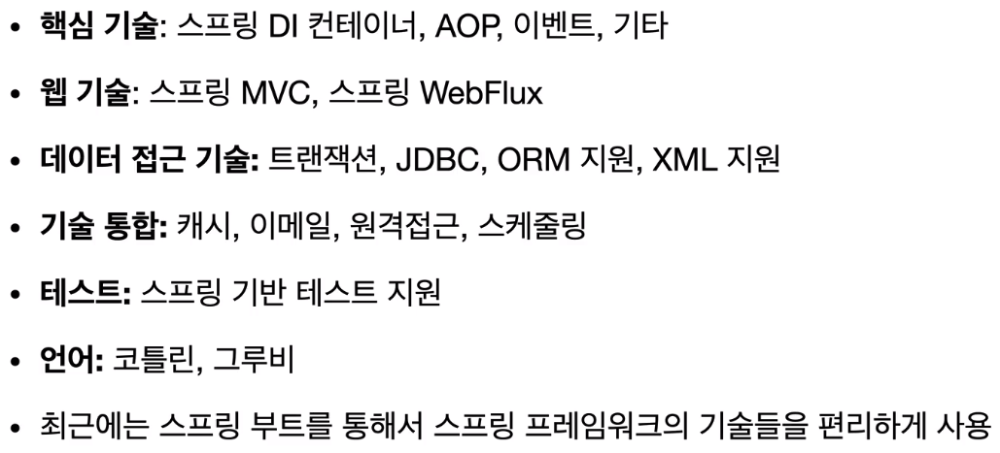
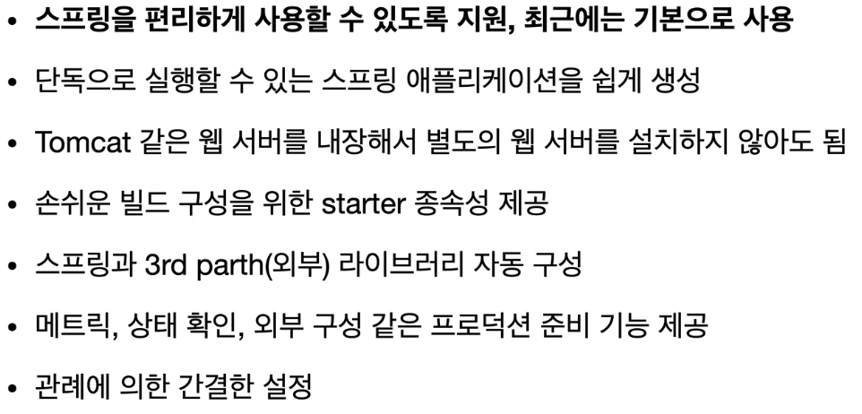

# Spring

## Birth

### EJB

EJB was one of the most used java API.
but there were several problems; complex, slow, expensive

- so concept of POJO was raised
- spring was made
- hibernate was made

#### Hibernate, JPA

JPA: persistence interface. implemented by hibernate, EclipseLink, etc.
Hibernate: software for mapping an object-oriented domain model to a relational database

### History

Spring is made to improve problems of EJB.
Includes bean factory, application context, POJO, DI, IoC ...

## What is spring?

### Core concept

- concept: framework based by java
- main feature: object-oriented programming language

spring helps to develop applications while making full use of benefits of oop language

### Components

- essential: spring framework, spring boot
- optional: data, session, security, Rest Docs, batch, cloud ...

#### Spring framework

#### Spring boot

- not seperated from spring
- functions to use spring conveniently

### Meaning of term `Spring`

1. spring DI container
2. spring framework
3. spring ecosystem including spring boot, spring framework, etc
